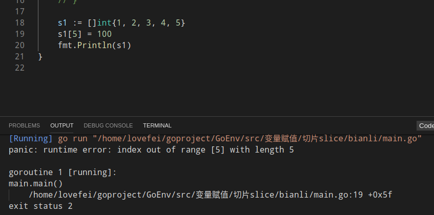

# 切片

1. 自定义切片

   ```go
   package main
   
   import (
   	"fmt"
   )
   
   func main() {
   	// 定义一个切片
   	var s1 []int
   	var s2 []string
   	//初始化切片
   	s1 = []int{1, 2, 3, 4}
   	s2 = []string{"name", "age", "addr"}
   	fmt.Println(s1, s2)
   
   	//长度和容量
   	fmt.Printf("len(s1): %d cap(s1):%d \n", len(s1), cap(s1))
   	fmt.Printf("len(s2):%d cap(s2):%d\n", len(s2), cap(s2))
   }
   
   //结果
   [1 2 3 4] [name age addr]
   len(s1): 4 cap(s1):4 
   len(s2):3 cap(s2):3
   ```

   

2. 由数组得到切片

   ```go
   	a1 := [...]int{1, 2, 3, 4, 5, 6, 7, 8, 9, 0}
   	s3 := a1[0:4]  //基于一个数组的切割，左包含，右不包含
   	fmt.Println("\n", s3)
   //结果
    [1 2 3 4]
   ```

   注: 错误

   ```shell
   # command-line-arguments
   AxiaoA\go_project\slice_01.go:20:2: undefined: a1
   AxiaoA\go_project\slice_01.go:21:8: undefined: a1
   #错误原因是因为没有定义a1
   ```

   

3. 切片再切片

   1. 就是拿已经切片了的来切片.
   2. 切片的容量是底层数组的容量


修改切片内的数字

#### make函数创建切片

切片的本质就是一个框,框柱一个连续的内存.

```go
package main

import (
	"fmt"
)

func main() {
	a1 := make([]int, 2, 10)  //创建一个长度为2 ,容量为10 的一个切片.
	fmt.Printf("%d ,len(a1)=%d .cap(a1)=%d", a1, len(a1), cap(a1))
}

//运行结果:
[0 0] ,len(a1)=2 .cap(a1)=10
```

切片的复制拷贝

```go
	s3 := []int{1, 2, 3, 4}
	s4 := s3
	fmt.Println(s3, s4)
	s3[2] = 100
	fmt.Println(s3, s4)
}
//结果是:  当切片所引用的底层数组发生改变的时候,其他所有引用该数组的切片都会改变.
[1 2 3 4] [1 2 3 4]
[1 2 100 4] [1 2 100 4]
```

切片遍历

```go
//切片的遍历
func main() {
	s := []int{1, 2, 3, 4, 5, 6, 7, 8, 9, 0}

	for i := 0; i < len(s); i++ {  //索引遍历 使用for循环
		fmt.Println(i, s[i], "first \n")
	}

	for index, value := range s {  //
		fmt.Println(index, value)
	}
}
```

切片的append方法

为切片追加元素.

```go
//调用append函数必须用原来的切片变量接收返回值
// append 追加元素的,原来的底层数组放不下的时候,go 底层就会吧底层数组换掉
...
	s1 = append(s1, 100)
	fmt.Printf("s1 = %v\n", s1)
}
---
s1 = [1 2 3 4 5 100]

...
   
	s1 = append(s1, 100, 230)
	fmt.Printf("s1 = %v \n", s1)
//一次追加多个
```



__这问题就是当你赋值的元素超过了数组的容量的时候,会提示index out of range __

copy

```go
 	s2 := s1  //s1 跟s2 使用的是同一个底层数组
	s3 := make([]int, 5, 5)
	copy(s3, s1)  //将s1 的数据保存到了s3中.改变s1和s2 ,s3不发生改变.
	fmt.Println(s1, s2, s3)
	s1[0] = 555
	fmt.Println(s1, s2, s3)

--- 输出结果:
[1 2 3 4 5] [1 2 3 4 5] [1 2 3 4 5]
[555 2 3 4 5] [555 2 3 4 5] [1 2 3 4 5]

```

从切片中删除元素

由于go语言中没有删除切片中函数的操作,所以使用append来组合

```go
 	s1 = append(s1[:1], s1[2:]...)
	fmt.Println(s1)
---
[555 3 4 5]

```

练习题

```go
	var a = make([]int, 5, 10) //初始的时候默认大小是5,所以里面就会默认存在5个0
	fmt.Println(a)
	for i := 0; i < 10; i++ {
		a = append(a, i)  //在0后面进行追加.
	}
	fmt.Println(a)
	fmt.Println(len(a))
----结果:
[Running] go run "/home/lovefei/goproject/GoEnv/src/变量赋值/切片slice/bianli/main.go"
[0 0 0 0 0]
[0 0 0 0 0 0 1 2 3 4 5 6 7 8 9]
15
```

排序

```go
...
var a1 = [...]int{1,2,3,5,8,5,6}
sort.Ints(a1[:])
fmt.Println(a1)
```

#### 指针 

go语言中不存在指针操作

1. &: 取地址

2.  *: 根据地址取值

   

```go
	n := 18
	fmt.Println(&n)  //这里输出的是n的地址

----

	n := 18
	fmt.Println(&n)   //输出的是n的地址
	p := &n   //p获取的是n的地址
	fmt.Println(p)  //这里的p是一个地址
	fmt.Printf("%T\n", p)  //类型的整形的取地址
	m := *p  //根据p这个地址可以取到的值
	fmt.Println(m)  //这里的这个m是 根绝地址p取到的值
	fmt.Printf("%T\n", m)  //这里输出的是m的地址
}
---输出结果是:
[Running] go run "/home/lovefei/goproject/GoEnv/src/变量赋值/切片slice/bianli/main.go"
0xc000098010
0xc000098010
*int
18
int

```

new 和make

```go
//new申请一个内存地址

	var a1 *int  //这里定义了一个int类型的地址,但是队形的地址是nil,所以没有办法给*a1赋值,会报错
	fmt.Println(a1)  //nil
	var a2 = new(int) //通过new给a2定义一个地址,这样a2就指向了一块地址
	fmt.Println(a2)  //输出的a2是一个地址
	fmt.Println(*a2) //*a2 是0
	*a2 = 100  //这里由于a2已经有地址,所以可以给a2赋值
	fmt.Println(*a2)  //这样可以取到a2地址的值是100
```

make

make也是用于内存分配的,区别于new,它只是作用于slice,map和chan的内存创建,而且返回的类型就是这三个类型本身.

1. make和new都是用来申请内存的
2. new很少用,一般用来给基本数据类型申请内存,`string`,`int` ,返回的都是对应的数据类型的指针(\* string, \* int)
3. make 是用来给`slice`,`map`, `chan`申请内存的,make函数返回的是对应的这三个类型本身.

```go
func make (t Type ,size ....IntegerType) Type
```


#### map

映射关系的map

定义语法:

```go
map [keyType]valueType
```

```go
	var m1 map[string]int  //这里定义的map是空的,值是nil,所以不能给map赋值
	fmt.Println(m1)
	m1 = make(map[string]int, 10)  //这里使用make给map申请了一块内存空间,申请了10个内存空间,容量大小后面可以根据数据的增加变多
	m1["www"] = 3  //定义key和value
	m1["kangxun9"] = 7
	fmt.Println(m1)
----
map[]  
map[kangxun9:7 www:3]

----
	fmt.Println(m1["www"])  //根据key查找value
	value, ok := m1["com"]  //通过if判断查找不存在的key和value,这里的value如果存在会得到值,不存在就不会被赋值,ok得到的是True和Flase.
	if !ok {
		fmt.Println("没有这个key")
	} else {
		fmt.Println(value)
	}

```

map的遍历

```go
for k ,v := range m1 {
    fmt.Println(k,v)
}

	for k := range m1 {   //单纯的输出一组key
		fmt.Println(k)
	}

	delete(m1, "com")   //删除一组key,value,如果删除的key不存在,那么就不做任何操作.
```

`studygolang.com` 这是go的官方文档.

元素为map的切片

```go
	var s1 = make([]map[int]string, 10, 10)  //这里是对切片进行初始化
	s1[0] = make(map[int]string, 1)   //这里对切片元素map进行初始化
	s1[0][10] = "www"  //给切片的map进行赋值
	fmt.Println(s1)
```

元素为切片的map

```go
	var s2 = make(map[string][]int, 10)
	s2["www"] = []int{1, 2, 3, 4, 5}
	fmt.Println(s2)
```

