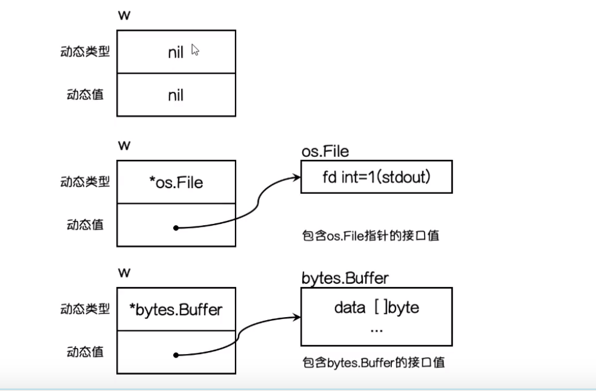
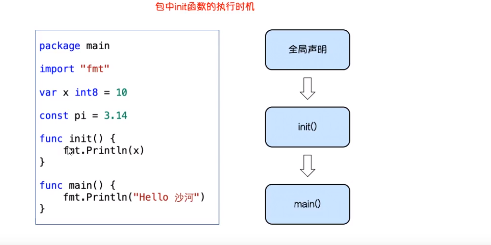
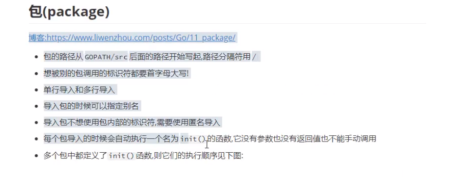
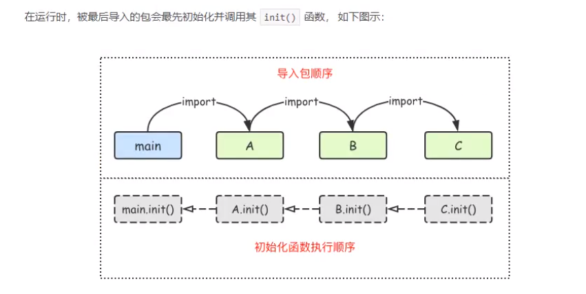

# 接口

接口是一个种类型

```go
package main

import "fmt"

//定义一个类型

type speaker interface {
	speak()  //只要实现了speaker方法的都是spaker类型.这里写的是要实现的方法,就是哪些方法要实现所有都能调用.可以写多个
}

type cat struct{}
type dog struct{}
type persion struct{}

func (c cat) speak() {
	fmt.Println("miaomiaomiao")
}
func (d dog) speak() {
	fmt.Println("miaomiaomiao")
}
func (p persion) speak() {
	fmt.Println("miaomiaomiao")
}

func da(x speaker) {
	x.speaker()
}
//要求无论谁调用da方法,都能成功调用,所以把speaker做成统一入口.
func main() {
	var c1 cat
	var d1 dog
	var p1 persion

	da(c1)
	da(d1)
	da(p1)

}

```

### 接口定义

```go
type 接口名称 interface {
    方法1
    方法2
}
```

只有当接口中的方法全部实现接口才能调用,如果没有实现,就不能调用.

```go
type animous interface {
    move()
    eat(string)
}

func ()move() {}

func (...) eat() {}  //这里不算实现,因为接口中调用的是eat(string),有参数的方法,而这里声明的是没有参数的

```

```go
package main

import "fmt"

type animal interface {
	move()
	eat()
}

type cat struct {
	name string
	feet int8
}

func (c cat) move() {
	fmt.Println("cat move")
}
func (c cat) eat() {
	fmt.Println("cat eat")
}

type chicken struct {
	feet int8
}

func (c chicken) move() {
	fmt.Println("激动")
}
func (c chicken) eat() {
	fmt.Println("吃鸡屎")
}

func main() {

	var a1 animal //定义一个接口类型的变量   

	bc := cat{   //给cat结构提赋值
		name: "tapqo",
		feet: 4,
	}
	a1 = bc   //讲结构体的值给接口,这样的话接口的机构体类型跟bc的结构提是一样的,
	a1.eat()  

}

```



#### 值接收者和指针接收者

```go
package main

import "fmt"

type animous interface {
	move()
	eat()
}

type cat struct {
	name string
	age  int
}

//使用值接受者实现接口的所有方法
func (c cat) move() {
	fmt.Println("走路", c.name)
}
func (c cat) eat() {
	fmt.Println("吃饭", c.age)
}

func main() {
	var a1 animous
	c1 := cat{"tom", 4}
	c2 := cat{"tommmmm", 4}
	a1 = c1
	fmt.Println(a1)
	a1 = &c2
	fmt.Println(a1)
}

```

使用指针接收者实现所有的方法

```go
func (c *cat) move() {
	fmt.Println("走路", c.name)
}
func (c *cat) eat() {
	fmt.Println("吃饭", c.age)
}

func main() {
	var a1 animous
	c1 := cat{"tom", 4}
	c2 := cat{"tommmmm", 4}
	a1 = &c1
	fmt.Println(a1)
	a1 = &c2
	fmt.Println(a1)
}

```

#### 同一个结构体可以实现多个接口

#### 并且结构体也可以嵌套

```go
package main

type animous interface {
	mover  //结构体嵌套
	eater
}
type mover interface {move()}  //结构体可以实现多个接口
type eater interface {eat()}
type cat struct {
	name string
	age  int
}

//使用值接受者实现接口的所有方法
func (c cat) move() {
	fmt.Println("走路", c.name)
}
func (c cat) eat() {
	fmt.Println("吃饭", c.age)
}


func main()  {
	
}
```

### 控接口

`interface {}` 

所有的类型都实现了控接口,任意类型的变量都能保存到空接口中.

```go
package main

import "fmt"

func main() {
	var m1 map[string]interface{}
	m1 = make(map[string]interface{}, 16)
	m1["name"] = "ll"
	m1["age"] = 900
	m1["merried"] = true
	m1["hobby"] = [...]string{"唱", "跳", "rap"}
	fmt.Println(m1)
}

```

空接口作为值传递

```go
func show(a interface{}) {
	fmt.Printf("%v\n", a)
}

func main() {
	var m1 map[string]interface{}
	m1 = make(map[string]interface{}, 16)
	m1["name"] = "ll"
	m1["age"] = 900
	m1["merried"] = true
	m1["hobby"] = [...]string{"唱", "跳", "rap"}
	fmt.Println(m1)

	show(m1)  //show方法可以接收任何值
	show(true)
}
---输出结果
[Running] go run "/home/lovefei/goproject/GoEnv/src/AxiaoA/go_project/func_c/func_12_interface/控接口/main.go"
map[age:900 hobby:[唱 跳 rap] merried:true name:ll]
map[age:900 hobby:[唱 跳 rap] merried:true name:ll]
true

[Done] exited with code=0 in 0.512 seconds
```

空接口可以存储任意类型的值,那么我们如何获取其中的具体数据呢?

```shell
想要判断接口中的值使用接口断言,其语法格式:
```

```go
1 | x.(T)
```

x: 表示类型为interface{}的变量

T:表示断言x可能是的类型

```go
func assign(a interface{}) {
	fmt.Printf("%T\n", a)
	str1, ok := a.(string)  //这里有两个参数得到
	if !ok {  
		fmt.Println("不是string类型")
	} else {
		fmt.Printf("%s是string类型", str1)
	}
}

func assign2(a interface{}) {
	fmt.Printf("%T\n", a)
	// }
	switch a.(type) {  //通过switch来判断类型是什么
	case string:
		fmt.Println("string")
	case int:
		fmt.Println("int")
	}
}

func main() {
	assign(100)
	assign2(100)
}

```


# 包

包中的标识符(变量名\函数名\结构体\接口等)如果首字母是小写的,表示私有(只能在当前包中使用)

首字母大写的标识符可以被外部的包调用

```go
package calc

func Dd( x, y int ){
    return x+y
    
}
```

调用包

默认是从go环境的src下面开始的

所以写的时候地址应该从src下面的第一级目录开始

```go
import (
	cara "AxiaoA/go_project/func_c/func_12_interface/func_package"  //cara是文件名称,引号中是路径.
	"fmt"
)

//默认情况下你的文件夹名称和包名是一样的,如果不一样的话,会默认在前面重命名一个cara(可以是别的)来声明一下.
//如果都是一样的,就不会再生成

//正常情况下目录和包名是一样的.
```

### 匿名包导入

```go
import _ "包路径"
```

init() 初始化函数

当包被导入的时候会自动执行.执行init()方法.没有参数也没有返回值.







### 文件操作

`os.open()`函数可以打开一个文件,返回一个*file和一个err.对得到的文件实例调用`close()`方法能够关闭.

```go
package main

import (
	"fmt"
	"io"
	"os"
)

func main() {
	fileobj, err := os.Open("./main.go") //打开文件
	if err != nil {
		fmt.Printf("%v", err)
		return

	}
	defer fileobj.Close() //这里为了防止忘记关,所以讲这个提前写在这里

	//读文件
	//var tmp = make([]byte,128) //指定长度.
	var tmp [128]byte
	for {
		n, err := fileobj.Read(tmp[:])
		if err == io.EOF {
			return
		}
		if err != nil {
			fmt.Printf("%v\n", err)
			return

		}
		fmt.Println(n)
		fmt.Println(string(tmp[:n]))

		if n < 128 {
			return
		}
	}

}
```


#### 文件写入

| 模式        | 含义     |
| ----------- | -------- |
| os.OWRONLY  | 只写     |
| os.O_CREATE | 创建文件 |
| os.O_RDONLY | 只读     |
| os.O_RDWR   | 读写     |
| os.O_TRUNC  | 清空     |
| os.O_APPEND | 追加     |

```go
func openFile(name string ,flag int ,perm FileMode)(*File, error)  {
	
}// 创建一个读写的方法，将内容写入到文件中，perm中的FileMode是指定文件的权限，只在linux上有用。
```

` perm`:文件权限，一个八进制数。r  04 w 02 x01

write ： 表示写的是字符

writeString： 表示写入字符串

```go

package main

import (
	"fmt"
	"os"
)

// funcopenFile(name string ,flag int ,perm FileMode)(*File, error)  {

// }
func main() {
	fileObj, err := os.OpenFile("./xx.txt", os.O_WRONLY|os.O_CREATE|os.O_APPEND, 0644)
	if err != nil {
		fmt.Printf("%v", err)
		return
	}
	fileObj.Write([]byte("1111111"))
	fileObj.WriteString("222222")
	fileObj.Close()
}
```


### 读文件

fileObject.read()

bufio

ioutil


