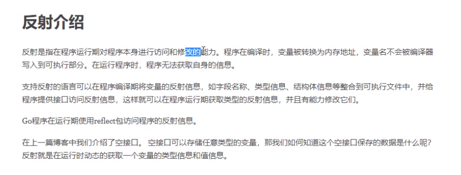
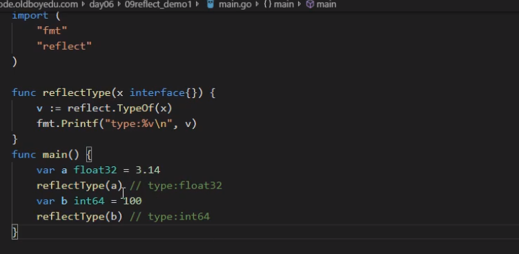
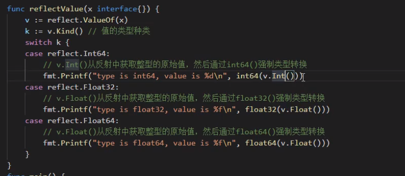

# 反射




```go
package main

import (
	"encoding/json"
	"fmt"
)

type persion struct {
	Name string `json:"name"`
	Age  int    `json:"age"`
}

func main() {
	str := `{"name":"111","age":9000}`
	// fmt.Println(str.Name)
	var p persion
	json.Unmarshal([]byte(str), &p)  //通过地址反射找到数据
	fmt.Println(p.Age, p.Name)
}

```

reflect.TypeOf (动态类型)



reflect.ValueOf (动态 类型)




