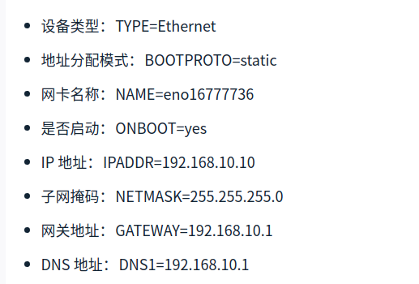
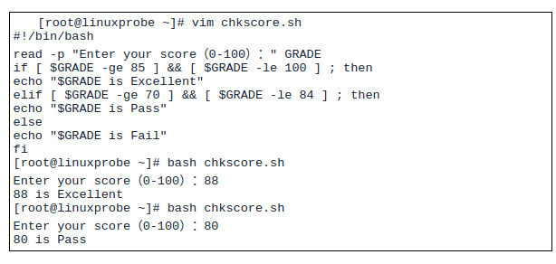

# linux基础

pidof  #用于查看进程的pid

```shell
pidof  sshd   #pidoff没有参数
```

uptime   #用于查看系统负载,输出的是1分钟 5分钟  15分钟的负载平均值

```shell
uptime

```

free 查看内存命令

```shell
free -m  #以兆作为单位
free -G   #以G作为单位
free -h  #输出更加人性化,看上去更舒服.

lovefei@lovefei-PC:~$ free -h
              total        used        free      shared  buff/cache   available
Mem:           7.7G        2.1G        1.3G        385M        4.3G        4.9G
Swap:          4.0G          0B        4.0G

```

history #查看使用过的历史命令,一般存放在.history中

```shell
#清除记录
history -c
```

sosreport 

```shell
#用于收集系统配置以及架构信息,并输出诊断文档,格式为sosreport
#当系统出现故障的时候,可以通过sosreport输出一些简单的运行状态和服务的配置信息.
#一路回车就可以, 会输出两行加黑的字体,一个是tar.gz的包,一个是一段 The checksum is: ....
```

cat #查看文本文档使用

```shell
cat -n  文件名称   #输出结果带有行号.

```

tr  #用于替换文本中的字符

```shell
cat 文本文档  | tr [a-z] [A-Z]
```

wc  #用于统计使用

```shell
wc -l  #显示行数
wc -w  #只显示单词数
wc -c   #显示字节数
```

stat  #显示文件的详细创建修改移动信息

```shell
stat  文件名称
#会显示Access,Modify,Change的详细信息.
```

cut  #按列取字符串

```shell
cut -d：-f1 /etc/passwd  #以: 作为分隔符,只看第一个单词.
```

touch  #创建文件

```shell
-a  仅修改读取时间 [atime]
-m  仅修改修改时间 [mtime]
-d  同时修改atime 和mtime
```

dd  

```shell
if  #输入的文件名
of  #输出的文件名
bs   #设置每个块的大小
count  #设置要重复块的个数
dd if=/dev/cdrom  of=RHEL-server-7.0-x86_64.iso
dd if=/dev/zero of=560_file count=1  bs=560M
```

tar

```shell
-c 创建压缩文件
-x 解开压缩文件
-t  查看压缩包内的文件
-z  用Gzip压缩或者解压
-j  用bzip2压缩或者解压
-v  显示压缩或者解压过程
-f  目标文件名
-p 保留原是权限和属性
-P 使用绝对路径来压缩
-C 指定解压到的目录
```

grep

```shell
-b  可执行文件当做文本文件来搜索
-c  仅显示找到的行数
-i  忽略大小写
-n 显示行号
-v  反向选择,仅列出没有[关键字]的行
```

find

```shell
-name 匹配名称
-perm  匹配权限(mode为完全权限,-mode为包含即可)
-user  匹配所有者
-group 匹配所有组
-mtime -n /+n  匹配修改内容的时间(-n表示n天以内,+n表示n天以外)
-atime  -n /+n  匹配访问文件的时间
-ctime -n /+n  匹配创建文件的时间
-nouser  匹配无所有者文件
-nogroup  匹配无所有组文件
-newer f1 !f2  匹配比f1新,但是比f2旧的文件
--type p/d/c/p/l/f  匹配文件类型(块设备,目录,字符设备,管道,链接,文本)
-size  匹配文件大小
-prune  忽略某个目录
-exec   后面执行其他命令
find /etc  -name "host*" -print
```

修改密码

```shell
echo "linuxpasswd"  | passwd --stdin root
```




```shell
DIR="/tmp/laoyuan"
if [ ! -e $DIR ]
then
mkdir -p $DIR
else
echo "file is alread"
fi
```



for循环


while循环


case


at  执行一次性计划

```shell
at 23:30
at > systemctl restart httpd
at >  此处同时摁下ctrl +D来退出本次设定
at -l  列出所有计划
或者
echo "systemctl restart httpd" | at 23:30
#删除计划
atrm  3 #这里的3是计划常见后产生的序列.
```

whereis  #查找命令位置

```shell
whereis  ls
```

useradd

```shell
-d 指定用户家目录
-e 设置用户到期时间 格式为 YYYY-MM-DD
-u 指定该用户的uid(用户身份号码)管理员1-100,非管理员1000+
-g 指定用户的初始的用户基本组
-G 指定一个或者多个扩展用户组
-N 不创建与用户同名的基本用户组
-s 指定该用户的默认解释器  (-s /sbin/nologin  )

```

```shell
groupadd  组名  #创建用户组
```

usermod  修改用户属性

```shell
-c  填写用户账户备注信息
-d -m  两者连用,可以更改用户家目录,并且将原来家目录下的文件拷贝到新的目录
-e  账户的到期时间
-g  变更用户所属组
-G 变更扩展用户组
-L 锁定用户禁止登录
-U 解锁用户
-s 变更默认终端
-u 修改用户uid

usermod  -G username  root

```

passwd

```shell
-l  锁定用户禁止登录
-u  解锁用户允许登录
-- 允许通过标准输入修改用户密码
-d  使该用户可以使用空目录登录
-e  强制用户在下次登录的时候修改密码
-S 显示用户密码是否被锁定,以及密码所采用的加密算法名称

```

userdel  

```shell
-f  强制删除用户
-r  同时删除用户的家目录
```

```shell
##资源
https://www.bilibili.com/video/BV1a4411B7V9?p=5
```


