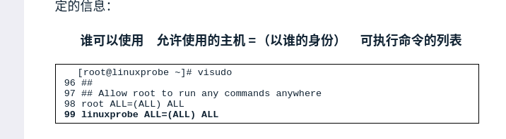

# suid sgid 

#### SUID

简介：

​	SUID是一种对二进制程序进行设置的特殊权限，可以让二进制程序的执行者临时用于属主的权限。

用户密码保存在`/etc/shadow`中。

#### SGID

* 让执行者临时拥有所属组的权限。
* 在摸个目录中创建的文件自动集成该目录的用户组。

```shell
chmod  #设置权限
chown  #设置所属用户和所属组
```

#### SBID是设置文件保护位.

```shell
chmod -R o+t  linux/
```


### sudo 与su

su用于用户切换,当从root用户切换到普通用户的时候

```shell
su - laoyuantou  #必须要有-(减号)这样就意味着完全切换到新用户,即把环境变量信息也变更为新用户的响应信息,而不保留原始用信息.
```

如果是普通用户切换到root需要注意两点

1. 需要输入root密码
2. 不需要使用 减号`-`

#### sudo的参数和作用

| 参数            | 作用                                                |
| --------------- | --------------------------------------------------- |
| -h              | 列出帮助信息                                        |
| -l              | 列出当前用户可以执行的命令                          |
| -u用户名或uid值 | 以指定的用户身份执行                                |
| -k              | 清空密码的有效时间,下次执行需要重新输入密码进行验证 |
| -b              | 后台执行指定命令                                    |
| -p              | 更改询问密码的提示语                                |

sudo功能

* 限制用户执行指定命令
* 记录用户执行的每一条命令
* 配置文件(/etc/sudoers)提供集中的用户权限、管理、主机参数。
* 验证码的后5分钟内,无须再让用户输入密码

**注:只有root用户可以使用visodu命令编辑sudo的配置文件sudoers**



**设置权限**

`谁可以使用`   `允许使用的主机` = `(以谁的身份) `  `可执行的命令列表`

```shell
#设定普通用户有root权限
laoyuantou  ALL=(ALL) ALL
#或者
laoyuantou ALL=(ALL) /usr/bin/cat   #只能执行cat命令
#取消密码验证
laoyuantou ALL=NOPASSWD: /usr/sbin/poweroff
```

__命令查询__  whereis   poweroff


