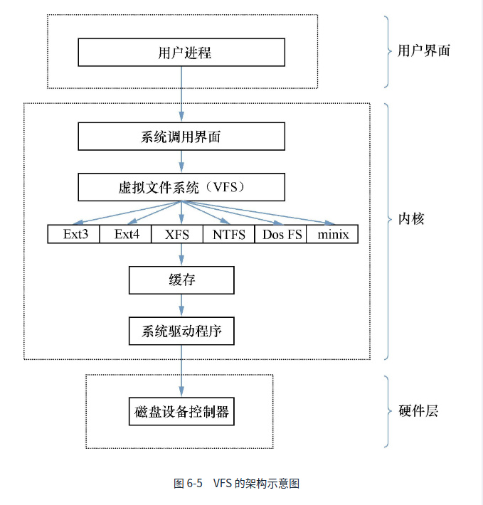
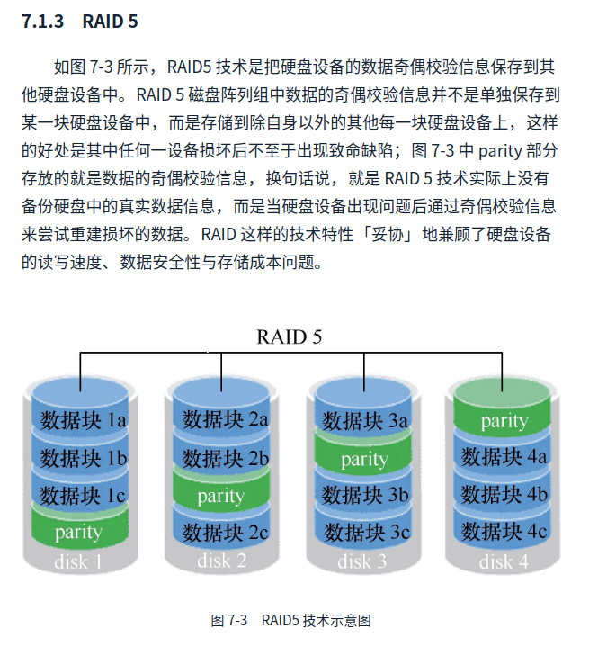
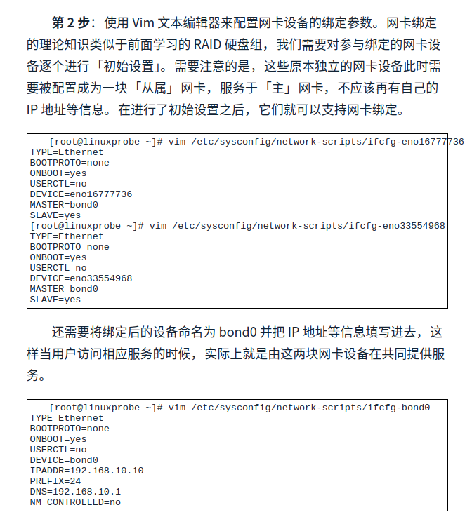

# 从磁盘开始

`FHS` 文件系统层次化标准

**目录名称以及对应功能**

| 目录名称    | 应放置文件内容                                          |
| ----------- | ------------------------------------------------------- |
| /boot       | 开机所需的文件---内核、开机菜单以及所需配置文件         |
| /dev        | 以文件的形式存放任何设备与接口                          |
| /etc        | 配置文件                                                |
| /home       | 用户家目录                                              |
| /bin        | 存放单用户模式下还可以操作的命令                        |
| /lib        | 开机时用到的函数库,以及bin与sbin下面的命令要调用的函数  |
| sbin        | 开机过程中需要的命令                                    |
| /media      | 用于挂载设备文件的目录                                  |
| /opt        | 用于存放第三方的软件                                    |
| /root       | 系统管理员的家目录                                      |
| /srv        | 网路服务的数据文件目录                                  |
| /tmp        | 任何人均可以正常使用的临时目录                          |
| /proc       | 虚拟文件系统,例如系统内核,进程,外部设备以及网络状态等   |
| /usr/local  | 用户自行安装的软件                                      |
| /usr/sbin   | linux系统开机时不会使用到的软件/命令/脚本               |
| /usr/share  | 帮助与说明文件,也可以放置共享文件                       |
| /var        | 主要粗放经常变化的文件,日志                             |
| /lost+found | 当文件系统发生错误的时候,将一些丢失文件片段存放在这里面 |

#### 常见硬件设备及其文件名称

| 硬件设备      | 文件名称             |
| ------------- | -------------------- |
| IDE设备       | /dev/hd[a-d]         |
| SCSI/SATA/U盘 | /dev/sd[a-d]         |
| 软驱          | /dev/fd[0-1]         |
| 打印机        | /dev/lp[0-15]        |
| 光驱          | /dev/cdrom           |
| 鼠标          | /dev/mouse           |
| 磁带机        | /dev/st0或者/dev/ht0 |

注意:

 1.  主分区或扩展分区的编号从1开始,到4结束

 2. 逻辑分区从编号5开始.

 3. sda5 : 这是系统中第一块被标识到硬件设备中分区编号为5的逻辑分区的设备文件.

     

inode表格记录的内容(默认大小是128字节)

* 该文件的访问权限(read , write , execute);
* 该文件的所有者和所属组(owner,group);
* 该文件的大小(size);
* 该文件创建或内容修改时间(ctime);
* 该文件的最后一次访问时间(atime);
* 该文件的修改时间(mtime);
* 文件的特殊权限(USID, SGID,SBIT)
* 该文件的真实数据地址(point);

#### **vfs(virtual File System,虚拟文件系统) **



**mount**

```shell
# 将sdb2 挂载到backup上
mount /dev/sdb2  /backup
```

开机自动挂载需要修改文件/etc/fstab

```shell
/dev/sdb2         /backup     ext4        defaults   0    0
# 设备文件			挂载内目录	存储类型      权限设置   自检  优先级
```

| 字段     | 含义                                                         |
| -------- | ------------------------------------------------------------ |
| 设备文件 | 一般为设备路径加设备名称,也可以是唯一标识符(uuid universally unique identififer) |
| 挂载目录 | 指定要挂载到的目录                                           |
| 格式类型 | 文件系统格式, ext3 ext4 xfs swap  iso9660                    |
| 权限选项 | 若设置为default :则默认权限为rw, suid dev exec auto nouser async |
| 自检     | 若为1则开机进行自检,若为0则不进行自检                        |
| 优先级   | 若自检为1 则可以对多块硬盘进行自检优先级设置                 |
|          |                                                              |

卸载

umount  /dev/sdb2

**fdisk**

参数

| 参数 | 作用                   |
| ---- | ---------------------- |
| m    | 查看全部可用参数       |
| n    | 添加新的分区           |
| d    | 删除某个分区的信息     |
| l    | 列出所有可用的分区类型 |
| t    | 改变某个分区的类型     |
| p    | 查看分区信息           |
| w    | 保存并退出             |
| q    | 不保存直接退出         |

格式化命令

**mkfs**

```shell
#比如要格式化成xfs格式
mkfs.xfs  /dev/sdb1
```

格式化成为swap分区的话使用的命令式

```shell
mkswap  /dev/sdb2
#使用swapon 命令将准备好的swap分区设备挂载到系统中
swapon /dev/sdb2
# swap分区的写法
/dev/sdb2         swap     swap    defaults   0   0
```

**quota进行磁盘容量配额管理**

* 软限制: 当达到存储限额的时候会提示,但是不会阻止
* 硬限制: 当达到存储配额的时候会提醒,同时会强制终止用户的操作



iptables和firewallds的区别

* iptables 服务会把配置好的防火墙策略交由内核层面的netfilter网络过滤器处理
* firewalld 服务则是把配置好的防火墙策略交给你和层面的nftables包过滤框架来处理

iptables 数据包

* 在进行路由选择前处理数据包(PREROUTING)
* 处理流入的数据包(INPUT)
* 处理流出的数据包(OUTPUT)
* 处理转发的数据包(FORWARD)
* 在进行路由选择后处理数据包(POSTROUTING)

参数:

* ACCEPT :允许流量通过
* REJECT: 拒绝流量通过  ,拒绝后回复拒绝了
* LOG: 记录日志信息
* DROP: 拒绝流量通过, 直接拒绝不给回复

iptables 的参数

| 参数         | 作用                                         |
| ------------ | -------------------------------------------- |
| -p           | 设置默认策略                                 |
| -F           | 清空规则链                                   |
| -L           | 查看规则链                                   |
| -A           | 在规则链的末尾添加规则                       |
| -I num       | 在规则链的头部加入新的规则                   |
| -D num       | 删除某一条规则                               |
| -s           | 匹配来源地址 IP/MASK,加叹号[!]表示除这个IP外 |
| -d           | 匹配目标地址                                 |
| -i 网卡名称  | 匹配从这块网卡流入的数据                     |
| -o 网卡名称  | 匹配从这块网卡流出的数据                     |
| -P(大写)     | 匹配协议,如TCP                               |
| --dport num  | 匹配目标端口                                 |
| --sport  num | 匹配来源端口号                               |

示例:

````shell
#添加允许icmp的策略
iptables -I INPUT -p icmp -j ACCEPT
#删除刚刚 添加的策略
iptables -D INPUT 1
#只允许特定的端口访问主机22端口
iptables -I INPUT -s 192.168.0.0/24 -p tcp --dport 22 -j ACCEPT	
#拒绝12345端口的访问
iptables -I INPUT -p tcp --dport 12345 -j REJECT
#拒绝单个主机访问80端口
iptables -I INPUT -p tcp --dport 80 -s 192.168.0.100 -j REJECT
#拒绝所有主机访问1000~1024端口
iptables -IINPUT -p tcp --dport 1000:1024 -j REJECT
````

保存到本地永久失效

```shell
service iptables save
```

### firewalld常用的策略

| 区域     | 默认规则                                                     |
| -------- | ------------------------------------------------------------ |
| trusted  | 允许所有的数据包                                             |
| home     | 拒绝流入的流量,除非与流出的数据相关;而如果流量与ssh,mdns,ipp-client ,amba-clinet,与dhcpv6-client 服务相关,则允许流量 |
| internal | 等同于home                                                   |
| work     | 拒绝流入的流量,除非与流出的流量相关,如果流量与ssh,ipp-client 与dhcpv6-client 服务相关,则允许流量 |
| public   | 拒绝流入的流量,除非与流出的流量相关,如果流量与ssh,dhcpv6-client 服务相关,则允许流量 |
| external | 拒绝流入的流量,除非与流出的流量相关,如果流量与ssh服务相关,则允许流量 |
| dmz      | 拒绝流入的流量,除非与流出的流量相关,如果流量与ssh服务相关,则允许流量 |
| block    | 拒绝流入的流量,除非与流出的流量相关                          |
| drop     | 拒绝流入的流量,除非与流出的流量相关                          |

进行终端管理需要用到命令firewall-cmd (由于命令参数比较长,因此允许使用tab补全)

| 参数                          | 作用                                               |
| ----------------------------- | -------------------------------------------------- |
| --get-default-zone            | 查询默认区域名称                                   |
| --set-default-zone=<区域名称> | 设置默认区域,使其永久生效                          |
| --get-zones                   | 显示可用区域                                       |
| --get-services                | 显示预先定义的服务                                 |
| --get-active-zones            | 显示当前正在使用的区域与网卡名称                   |
| --add-source=                 | 将源自此IP或者子网的流量导入指定的区域             |
| --remove-source=              | 移除上面设定的导入                                 |
| --add-inteface=<网卡名称>     | 将网卡与某个区域进行关联                           |
| --list-all                    | 显示当前区域的网卡配置参数,资源,端口以及服务等信息 |
| --list-all-zone               | 显示当前区域的网卡配置参数,资源,端口以及服务等信息 |
| --add-service=<服务名>        | 设置默认区域允许该服务的流量                       |
| --add-port=<端口/协议>        | 设置默认区域允许该端口的流量                       |
| --remove-service=<服务名>     | 移除                                               |
| --remove-port=<端口/协议>     | 移除                                               |
| --reload                      | 立即生效配置,并覆盖当前的配置                      |
| --painc-on                    | 开启应急状态模式                                   |
| --painc-off                   | 关闭应急状态模式                                   |
|                               |                                                    |

使用示例

```shell
#查看firewalld服务所在zone
[root@strong laoyuantou]# firewall-cmd --get-default-zone
public
#查看网卡的所在zone
[root@strong laoyuantou]# firewall-cmd --get-zone-of-interface=eno16777736
public
#修改网卡胡默认信息是[root@strong laoyuantou]# firewall-cmd --get-zone-of-interface=eno16777736
public
#修改网卡的默认区域是external 重启后生效
[root@strong laoyuantou]# firewall-cmd --permanent --zone=external --change-interface=eno16777736
success
#把firewalld服务中的请求https协议的流量设置为永久允许,并立即生效
[root@strong laoyuantou]# firewall-cmd --zone=public --add-service=https
success
[root@strong laoyuantou]# firewall-cmd --permanent --zone=public --add-service=https
success
[root@strong laoyuantou]# firewall-cmd --reload   //立即生效
success
#设置8080和8081端口流量策略为允许
[root@strong laoyuantou]# firewall-cmd --zone=public --add-port=8080-8081/tcp
success
#这是端口流量转发
[root@strong laoyuantou]# firewall-cmd --permanent --zone=public --add-forewalld-port=port=888:porto=tcp:toport=22:toaddr=192.168.0.100  //这里的ip是被设置的ip地址
[root@strong laoyuantou]# firewall-cmd --reload   //立即生效
```

### snat技术查询一下

### nmtui配置网络参数   //图形化配置,输入nmtui回车就会出现图形化.

### nmcli 

用于管理NetworkManager

查看状态nmcli  connection show  

### 绑定两块网卡

宿主机有两块网卡,设置网卡为主从模式



网卡的三种驱动模式

1. mode0 (平衡负载模式): 平时两块网卡均工作,且自动备援,但是需要在与服务器本地网卡相连的交换机设备上进行端口聚合来支持绑定技术.
2. mode1(自动备援模式): 平时只有一块网卡工作,在它故障自动替换另一块网卡
3. mode6(平衡负载模式): 平时两块网卡均工作,且自动备援,无须交换机设备提供辅助支持

注: mode6当一块网卡出现故障时切换只用100毫秒

vim /etc/modprobe.d/bond.conf

```shell
alias bond0 bonding
options bond0  miimon=100 mode=6
#重启网卡即可绑定成功
systemctl restart network
```

sshd


getsebool -a | grep http  查询关于http相关的安全策略

htpasswd -C  /etc/httpd/passwd  laoyuantou   #给httpd设置密码


