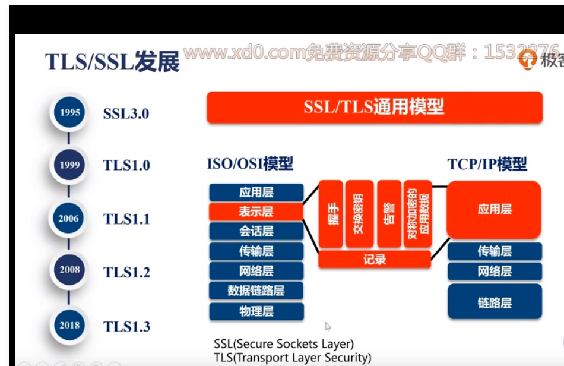
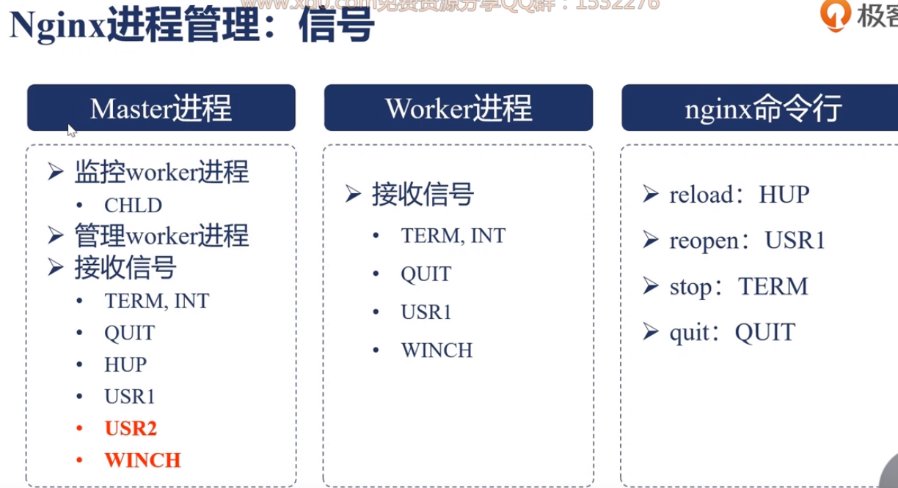
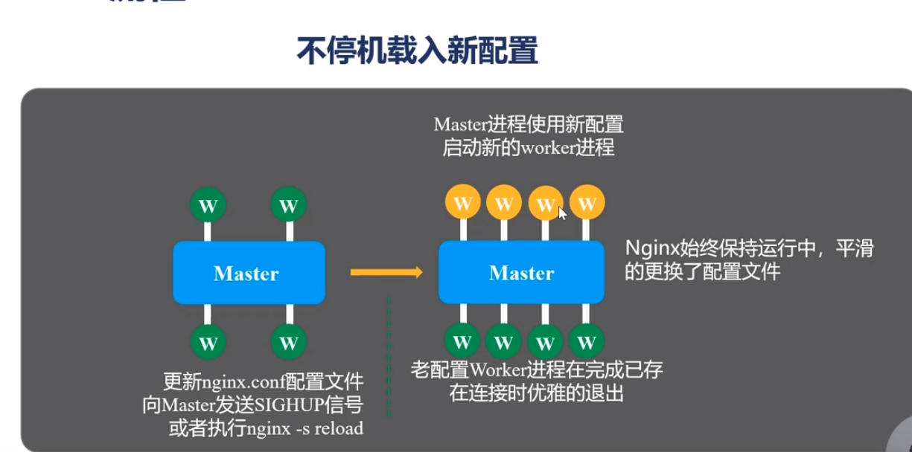

# nginx


并发和连接数


安装nginx

下载解压nginx,由于本身vim没有办法识别nginx文件的色彩,所以需要执行

`cp -r  contrib/vim/*  ~/.vim/`

nginx的源代码在`src`目录下

```shell
./configure --help | more   可以显示安装用到的模块和方法。

--prefix=PATH   #安装目录
--modules-path=PATH   动作模块
--lock-path=PATH   #日志存放目录
--with-***  #这种默认是不会自己安装的，需要指定编译
--without-** #默认是安装的过程中编译进去，但是如果写上了，那么就证明要取消编译

```

执行完成./configure那么就会将中间过程安装在objs中，ngx_modules.c中写了编译的过程。

make过程中产生的中间件都在src中


nginx热部署。

``` go
# cp nginx nginx.old   #这里拷贝的是nginx的执行文件
# cp -rf nginx /usr/local/openresty/nginx/sbin   #这里复制的也是nginx的执行文件。
# kill -USR2 PID   #就可以进行设备的热替换  这样的话会优先停止nginx的master进程，然后再讲重启一个新的master，然后再将老的worker进行停止，启动worker。
#  kill -WINCH PID  #然后平滑的关闭老的nginx的master和worker进程。
#会保留一个老的进程，然后保证nginx的回退，

```

日志切割

```go
# mv taohui_access.log   taohui_access.log_bak
../sbin/nginx  -s reopen  #重新进行日志的存储

```

日志备份


```go
nginx的配置

server {
    listen  8080;
    server_name  geek.taobhui.pub
    
    access_log  logs/xxx.log  main;
    
    location / {  #将所有请求发送到下面这个目录
        alias  dlib/;  
    }
    
}
```

控制压缩的

```shell
gzip on; #打开压缩
gzip_min_length 1 ;  #小于1字节就不压缩了
gzip_comp_level 2 ;
gzip_types ....;  #设置哪些不进行压缩
```


```go
location / {
    autoindex  on;  #这样的话就可以显示文件目录了.一般用在显示源用
    set $limit_rate 1k;  #设置大文件的响应速度，每秒传输多少kb字节的速度
}
```

```shell
http {
	log_format  main ...; #定义日志的格式， main：是给这个格式命名叫main

	server {
		access_log  logs/logname.log  main;  #定义日志的存放地址，这里的main跟上面的main是一样的。  
	}
}
```

nginx增加缓存

上游服务器：

```shell
http {
	...
	proxy_cache_path  /tmp/nginxcache levels=1:2  keys_zone=my_cache:10m max_size=10g  inactive=60m use_temp_path=off;
}  #设置存储目录
```

反向代理服务器

```shell
upsteam local {
	server 127.0.0.1:8080;
}

server {
	server name ip;
	listen 80;
	
	location / {
		proxy_set_header  Host  $host;
		
		
	}
}
```

### GoAccess实时分析nginx站点


```shell
goaccess accesssLogPath -o /new/html/paht.html  --real-time-html  --time-format='%H:%M:%S'    --date-format="%d/%b/%y"  --log-format=COMBINED
```




#### 自生成秘钥

```yaml
# yum install python2-certbot-nginx
# certbot --nginx --nginx-server-root=/usr/local/openresty/nginx/conf/ -d geektime.taohui.hub

```

### openresty


生产中nginx采用多进程模型

> 就是一个master进程和多个worker进程,worker进程的个数跟cpu的核数是一致的.
>
> 如果采用多线程的话,由于多个线程使用的是同一个地址空间,所以当其中一个线程出现问题的时候,就会引起nginx的整个应用挂掉,由于nginx需要保证高可用和高可靠性.







* 


nginx的处理过程


