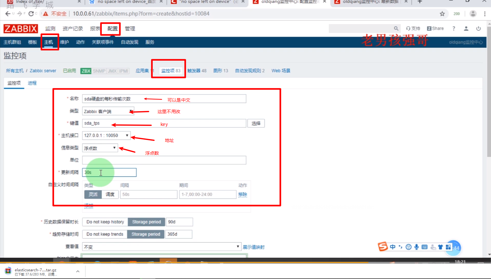

# zabbix

常用的监控命令

* free
* df
  * df -h  用于监控块存储的大小
  * df -ih  用于查看inode大小（最大文件数）  `报错信息: no space  left no device (磁盘空间不足)`
* top
* htop（epel）
* uptime
* iftop    #查看网络连接的命令
* iostat    #查看磁盘IO    tps:代表每秒传输的次数
* iotop     #查看进程占得磁盘占用率
* vmstat   #以上的专供的大概的
* netstat   #netstat -antp | grep 80  查询一下连接数 | grep -c "关键字" (-c 是计数的)   //监控并发
* nethogs   #每个进程用了多少流量

#### 查询安装包的名称

`yum provides  命令名`

`ab压测:`

```shell
ab -n 10000 -c 10  http://页面
```

```shell
#shell脚本来监控服务器
```

```shell
[root@zabbix /var/lib 14:47:21 59 ]#  iostat
Linux 3.10.0-1127.el7.x86_64 (zabbix.Service) 	05/08/2020 	_x86_64_	(1 CPU)

avg-cpu:  %user   %nice %system %iowait  %steal   %idle
           5.62    0.00    1.09    0.04    0.00   93.24

Device:            tps    kB_read/s    kB_wrtn/s    kB_read    kB_wrtn
vda               5.68        17.12       185.02    1497360   16181596
dm-0              4.58        13.02       176.14    1138423   15404577
dm-1              0.01         0.04         0.02       3740       1624
dm-2              0.04         0.01         0.55       1214      48323
dm-3              0.49         3.85         8.14     336842     711676

[root@zabbix /var/lib 14:47:56 60 ]# //筛选数据
[root@zabbix /var/lib 14:47:04 58 ]#  iostat | awk '/vda/'   
vda               5.68        17.13       185.09    1497360   16180914
```

#### 用户自定义参数

修改/etc/zabbix/zabbix-agent.conf  中的UserParameter=

格式 `UserParameter=<key>,<shell command>`

```shell
UserParameter=sda_tps,iostat | awk '/vda/{print $2}'
```



手动取值的话用`zabbix-agent -s ip地址 -k  sda_tps` 如果可以取到值的话，那么就可以正常调用。

定义触发器：


触发器语句组成

```shell
{Zabbix server:system.user.num.last()}>3
```

* Zabbix server: 监控的主机名字
* system.user.num: key的名字
* last():last是上面的key调用的函数方法

自定义触发器:


