# 面试总结

**cdn下载监控显示request time突曾，可能是源站返回了下面哪个状态码？**

A 502

B 503

C 504

D 429


CDN作用：

​	1.实现跨运营商、跨地域的全网覆盖

 2. 为了保护网站的安全

     1. > CDN的负载均衡和分布式存储技术,可以加强网站的可靠性,相当于一把无形中的保护伞,应对绝大多数的互联网攻击事件,防攻击系统也能避免网站遭到恶意攻击.

 3. 可以做异地灾备

     1. > 当服务器发生故障的时候,系统将会调用其他的临近的健康服务节点进行服务,进而提供近乎100%的可靠性,保证站点永不宕机

 4. 节约成本投入

     1. >  使用CDN加速可以实现网站的全国铺设，你根据不用考虑购买服务器与后续的托管运维，服务器之间镜像同步，也不用为了管理维护技术人员而烦恼，节省了人力、精力和财力。

 5. 为了让你更专注业务本身

    **主要特点**

    1. 本地Cache加速，提高了企业站点（尤其含有大量图片和静态页面站点）的访问速度，并大大提高以上性质站点的稳定性
    2. 镜像服务消除了不同运营商之间互联的瓶颈造成的影响，实现了跨运营商的网络加速，保证不同网络中的用户都能得到良好的访问质量。
    3. 远程加速 远程访问用户根据DNS负载均衡技术 智能自动选择Cache服务器，选择最快的Cache服务器，加快远程访问的速度
    4. 带宽优化 自动生成服务器的远程Mirror（镜像）cache服务器，远程用户访问时从cache服务器上读取数据，减少远程访问的带宽、分担网络流量、减轻原站点WEB服务器负载等功能。
    5. 集群抗攻击 广泛分布的CDN节点加上节点之间的智能冗余机制，可以有效地预防黑客入侵以及降低各种D.D.o.S攻击对网站的影响，同时保证较好的服务质量 。

    **CDN给谁加速**

    1. 直接对单个三级域名进行加速

    **优势是啥**

    1. 保证节点的可用性,当节点不可用的时候会剔除.
    2. 部署简单,不影响原站点

    **CDN和机房双线的区别**

    1. 双线机房只能解决电信联通之间的延迟问题,对其他延迟没有实质的解决
    2. CDN可以保证访问者访问的是最快的最稳定的

    **CDN缓存问题解决办法**

    1. CDN管理面板提供了URL推送服务,来通知各个节点刷新自己的缓存
    2. 各个节点收到推送后,会删除本地缓存
    3. 推送的太多可以选择目录推送

    **网站新增页面和站点不需要URL推送**

    **不适合的群体**

    1. 适度的用户群  
       * 针对性, 特定性
       * 服务少数用户
    2. 极端本地化用户群
       * 给定地理区域
       * 本地化
    3.  监管和复杂的之力要求
       * 用户数据敏感
       * 数据管辖范围权限

    6. **访问出现412**

    > 可能是网站做了鉴权,同时存在很多的盗链,因此有412

    **返回状态504**

    > 表示三次握手失败,网关超时

    **502**

    > 三次握手成功,但是首包超时,或者客户端read payload 超时.

    **500**

    > 代表服务端应用不可用

    **503**

    > 服务器当前无法处理请求,一段时间后会自动恢复.

    **428 Precondition Requeired(要求先决条件)**

    > 先决条件是客户端发送 HTTP 请求时，必须要满足的一些预设条件。一个好的例子就是 If-None-Match 头，经常用在 GET 请求中。如果指定了 If-None-Match ，那么客户端只在响应中的 ETag 改变后才会重新接收回应。
    >
    > 先决条件的另外一个例子是 If-Match 头，一般用在 PUT 请求上，用于指示只更新但没有被改变的资源。这在多个客户端使用 HTTP 服务时用来防止彼此间覆盖相同内容的情况。
    >
    > 当服务器端使用 [428 Precondition Required 状态码](http://tools.ietf.org/html/rfc6585#section-3)时，表示客户端必须发送上述的请求头才能执行该请求操作。这个方法为服务器提供一种有效的方法来阻止 “lost update”问题的出现。

    **429 Too Many Rquests (太多请求)**

    > 当你需要限制客户端请求某个服务的数量，也就是限制请求速度时，该状态码就会非常有用。在此之前，有一些类似的状态码。例如“509 Bandwidth Limit Exceeded”。
    >
    >如果你希望限制客户端对服务的请求数，可使用 429 状态码，同时包含一个 Retry-After 响应头用于告诉客户端多长时间后可以再次请求服务。
    >
    
    **413 Request Header Fields Too Large（请求头字段太大）**
    
    > 某些情况下的请求头会特别大
    
    **511 Network Authentication Required**
    
    **520**
    
    > 来自服务器的未知错误,一般就是服务器已经接收了数据.520错误本质上是一个捕获全部的响应当原始服务器返回一些未知的或者一些不能被解释的协议违反或者空响应。意味着上游道服务器和网关/代理不同意的协议交换数据

```shell
1XX 100-101 信息度提问示
2XX 200-206 成功
3XX 300-305 重定向
4XX 400-415 客户答端错误回
5XX 500-505 服务器错答误
```

[地址是](<https://www.cnblogs.com/gisblogs/p/7121943.html>)


    requesr_ time
    
    * 指的是从接收用户请求的第一个字到发送完响应数据的时间,即包括接收请求的数据时间、程序响应时间、输出响应时间。
    
    **upstream_response_time**
    
    * 是指从nginx向后端(php-cgi)建立连接开始到接受完整数据然后关闭连接为止的时间.
    
    从上面的描述可以看出，$request_time肯定比$upstream_response_time值大，特别是使用POST方式传递参数时，因为Nginx会把request body缓存住，接受完毕后才会把数据一起发给后端。所以如果用户网络较差，或者传递数据较大时，$request_time会比$upstream_response_time大很多。
    
    所以如果使用nginx的accesslog查看php程序中哪些接口比较慢的话，记得在log_format中加入$upstream_response_time。

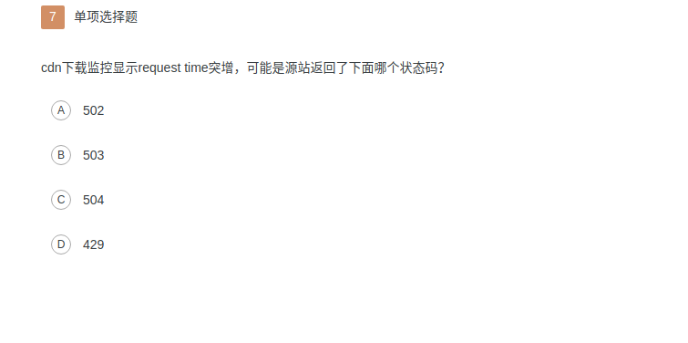  (B)

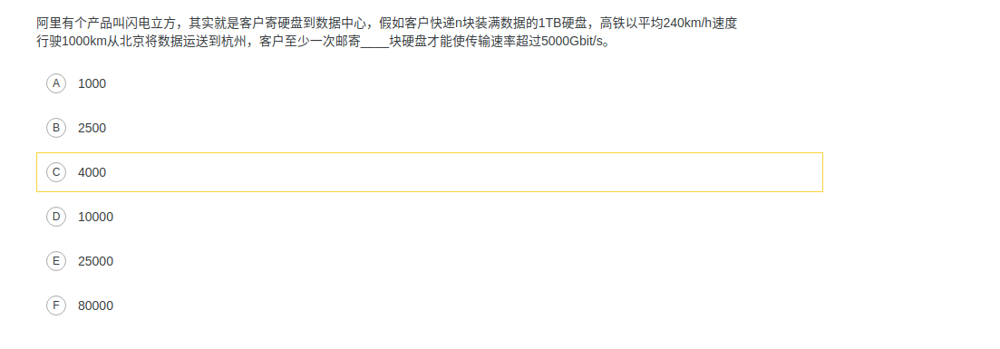

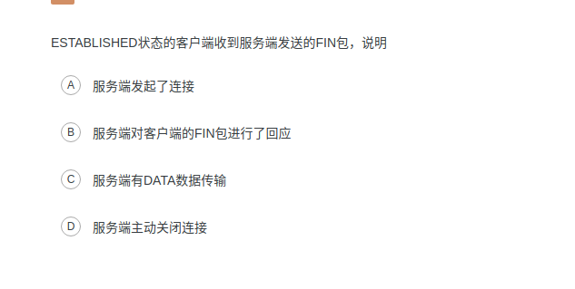

ESTABLISHED状态的客户端收到服务端发送的FIN包，说明：

**TCP状态转移要点**

​		tcp 协议规定，对于已经建立的连接，网络双方要求进行四次握手才能断开连接，如果缺少了其中某个步骤，将会使得连接处于假死状态，连接本身占用的资源不会被释放。网络服务器程序要同事管理大量连接。所以有必要保证无用的连接完全断开，否则大量僵死的连接会浪费许多服务器资源。在众多的tcp状态中。着重关注： `CLOSE_WAIT`和`TIME_WAIT`

1. **LISTENING**

   * FTP服务启动后首先处于监听（LISTENING）状态。

2. **ESTABLISHED**

   * 建立连接，表示两者正在通信

3. **CLOSE_WAIT**

   * 对方主动关闭连接或者网络异常导致连接中断，这是我方现在状态是**CLOSE_WAIT**。此时我方需要调用close（）来使得连接正确关闭。

4. **TIME_WAIT**

   * 我方主动调用close（）断开连接，收到对方确认后状态变成TIME_WAIT
   * 协议一般持续时间是2msl（两倍的分段最大生存期），用来确保旧的状态不会对新的连接产生影响
   * 处于该状态的连接占用资源不会被内核释放
   * 所以作为服务端尽量不要主动断开连接，以减少`TIME_WAIT`状态造成的资源浪费.

   `目前有一种避免TIME_WAIT资源浪费的方法，就是关闭socket的LINGER选项。但这种做法是TCP协议不推荐使用的，在某些情况下这个操作可能会带来错误。`

   ### socket状态

   | 状态         | 解释                                                         |
   | ------------ | ------------------------------------------------------------ |
   | CLOSED       | 没有使用过这个套接字[netstat 无法显示closed状态]             |
   | LISTEN       | 套接字正在监听连接[调用listen后]                             |
   | SYN_SENT     | 套接字正在试图主动建立连接[发送SYN后还没有收到ACK]           |
   | SYN_RECEIVED | 正在处于连接的初始同步状态[收到对方的SYN,但是还没有收到自己发过去的SYN的ACK] |
   | ESTABLISHED  | 连接已建立                                                   |
   | CLOSE_WAIT   | 远程套接字已经关闭:正在等待关闭这个套接字[被动关闭的一方收到FIN] |
   | FIN_WAIT_1   | 套接字已经关闭,正在关闭连接[发送FIN,没有收到ACK也没有收到FIN] |
   | CLOSING      | 套接字已经关闭,远程套接字赈灾关闭,暂时挂起关闭确认[在FIN_WAIT_1状态下收到被动方的FIN] |
   | LAST_ACK     | 远程套接字已关闭,正在等待本地套接字的关闭确认[被动方在CLOSE_WAIT状态下发送FIN] |
   | FIN_WAIT_2   | 套接字已经关闭，正在等待远程套接字关闭[在FIN_WAIT_1状态下收到打过去的FIN对应的ACK] |
   | TIME_WAIT    | 这个套接字已经关闭,正在等待远程套接字的关闭传送[FIN、ACK、FIN、ACK都完毕，这是主动方的最后一个状态，再过2msl时间后变成CLOSED状态] |
   |              |                                                              |

   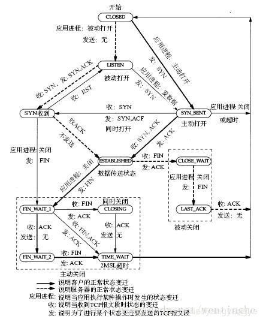

   

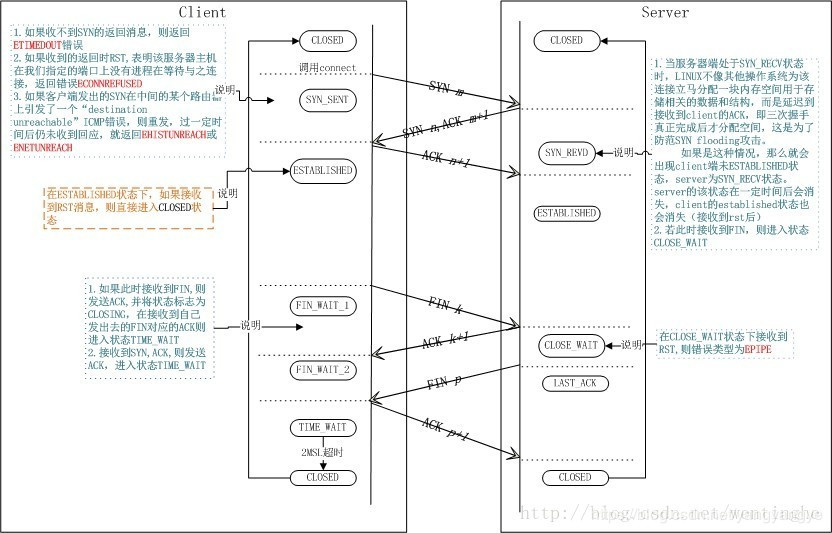

**四次挥手**

假设Client端发起中断连接请求，也就是发送FIN报文。Server端接到FIN报文后，意思是说"`我Client端没有数据要发给你了`"，但是如果你还有数据没有发送完成，则不必急着关闭Socket，可以继续发送数据。所以你先发送ACK，"`告诉Client端，你的请求我收到了，但是我还没准备好，请继续你等我的消息`"。这个时候Client端就进入FIN_WAIT状态，继续等待Server端的FIN报文。当Server端确定数据已发送完成，则向Client端发送FIN报文，"`告诉Client端，好了，我这边数据发完了，准备好关闭连接了`"。Client端收到FIN报文后，"`就知道可以关闭连接了，但是他还是不相信网络，怕Server端不知道要关闭，所以发送ACK后进入TIME_WAIT状态，如果Server端没有收到ACK则可以重传。`“，Server端收到ACK后，"`就知道可以断开连接了`"。Client端等待了2MSL后依然没有收到回复，则证明Server端已正常关闭，那好，我Client端也可以关闭连接了。Ok，TCP连接就这样关闭了！


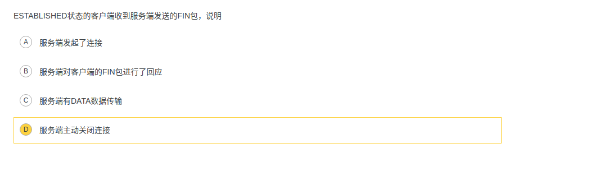

(D)


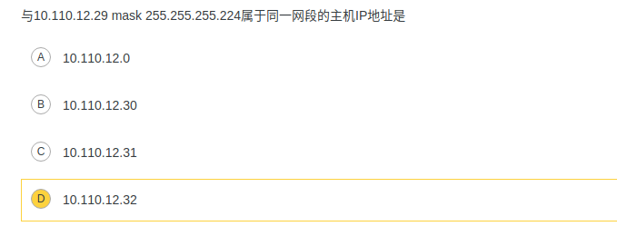

关于网段

0000 0000 .0000 0000 .0000 0000. 0000 0000


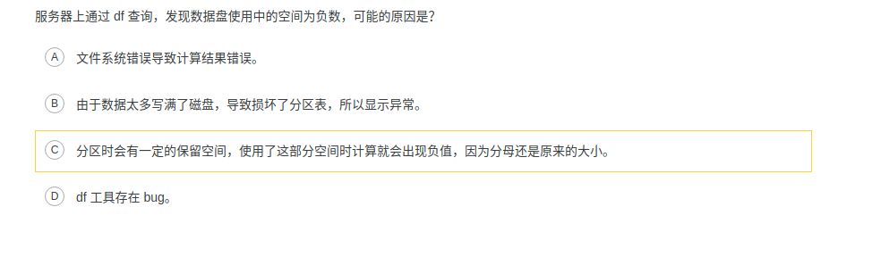

df查询空间为负数:

​	linux系统磁盘分区有保留区概念,会给root或者指定用户预留出5%或者更大的空间,当使用到这块保留区域的空间时,fdisk的计算就会变成负数.

解决办法: 需要通过rm命令清理删除磁盘中的大文件,释放预留空间的占用后,再通过df查询磁盘占用即可恢复正常.

df 命令的一些解释:

| 参数           | 解释                           |
| -------------- | ------------------------------ |
| df -hl         | 查看磁盘剩余空间               |
| df -h          | 查看每个根路径的分区大小       |
| du -sh 目录名  | 返回该目录的大小               |
| du -sm  文件夹 | 返回该文件夹送M数              |
| du -h  目录名  | 查看指定文件夹下所有文件的大小 |


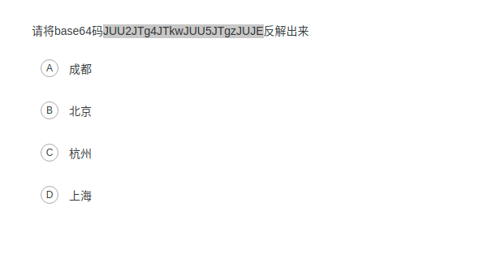

linux上的base64加密

**一 . 加密格式**

> 从标准输入中读取数据,按ctrl+D结束输入.将输出的内容编码为base64字符串输出

**格式**

> echo "str"| base64
>
> 将字符串str+换行 编码为base64字符串输出.

**格式2**

> echo -n "str" | base64
>
> 将字符串str编码为base64字符串输出.

**二. 解密格式**

**格式**

> base64 -d
>
> 从标准输入的内容中读取已经进行base64编码的内容,解码输出.

**格式2**

>  base64 -d -i 
>
> 从标准输入中读取已经进行base64编码的内容,解码输出. 加上 -i 参数,忽略非字母表字符,比如换行符.

**实例**

> echo "str" | base64 -d
>
> 将base64编码的字符串str+换行 解码输出。
>
> echo -n "str" | base64 -d
>
>  将base64编码的字符串str解码输出。
>
> base64 -d file 
>
> 从指定的文件file中读取base64编码的内容，解码输出。

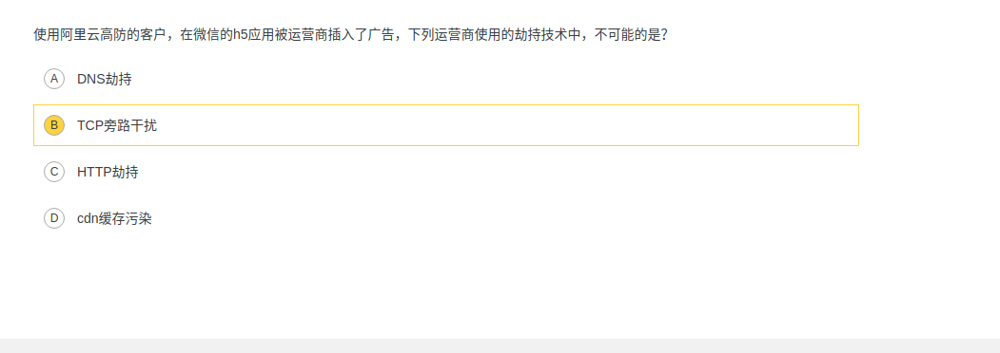

h5被植入广告.

1. 劫持方式

   1. DNS劫持

      > 这种劫持会把你定位到其他的网站,一般钓鱼网站就是这么实现的.违法

   2. HTTP劫持

      > 虽然DNS劫持已经被监管了起来，但是还有HTTP劫持啊！你DNS解析的域名的IP地址不变，当运营商发现你的是HTTP请求时，就会在里面插入一些奇奇怪怪的广告（比如一些banner、浮标、更有甚把你你的商品位给劫持了 WTF...）并且这种现象十分常见，不信你可以试着随便打开一个网页，仔细看看你就会发现一些小尾巴，这就是被HTTP劫持了。

   3. HTTPS劫持

      > 1. 伪造证书,通过病毒或者其他的方式将伪造证书的根证书安装到用户系统中.较难实现,比较少
      > 2. 代理也有客户的证书和私钥,或者客户端与代理认证的时候不校验合法性,即可以通过代理来与我们的服务端进行数据交互(较多)

2. 防运营商劫持

   1. 通过防 script iframe 注入型劫持,95%以上是这种劫持.
   2. [原文地址](<https://juejin.im/post/5bea7eb4f265da612859a9e4>) [隐藏iframe](<https://juejin.im/post/5b06feb46fb9a07a9d70bf04>)
3. 总结

      目前运营商劫持率大约是3% ~ 25%，它们无处不在。

      为了还用户一个干净安全的浏览环境，我们需要做好预防措施

      1. 全站https，能防一部分
      2. 加入防运营商劫持代码，能防大部分注入型劫持
      3. 记录Log，记录证据，向工信部投诉

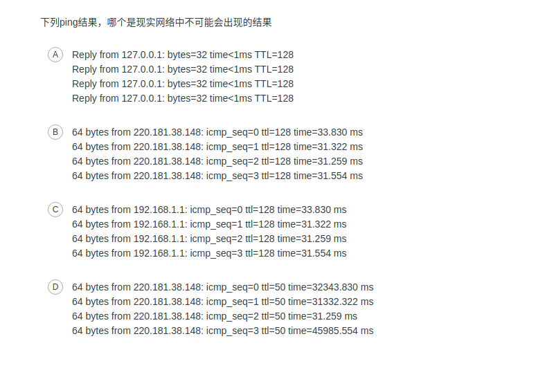


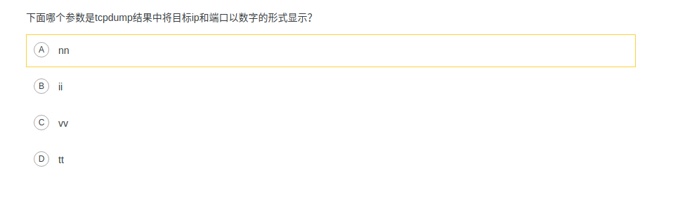

tupdump 参数

| 参数       | 解释                                                         |
| ---------- | ------------------------------------------------------------ |
| -a         | 将网络地址和广播地址转变成名字                               |
| -d         | 将匹配信息的代码以人们能够理解的汇编格式输出                 |
| -dd        | 将匹配的信息包的代码以c语言程序段的格式给出                  |
| -ddd       | 将匹配的信息包的代码以十进制的心事给出                       |
| -e         | 在输出行打印出数据链路层的头部信息,包含源mac和目的mac,以及网络层协议 |
| -f         | 讲外部的internet地址以数字的形式打印出来                     |
| -n         | 指定将每个监听到的数据包中的域名转换成ip显示,不把网络地址转换成名字 |
| -nn        | 指定将每个监听到的数据包中的域名转换成IP、端口从应用名称转换城端口号后显示 |
| -t         | 在输出的每一行打印时间戳                                     |
| -v         | 输出一个稍微详细的信息，例如在ip包中可以包括ttl和服务类信息  |
| -vv        | 输出详细豹纹信息                                             |
| -c         | 在收到指定包的信息后，tcpdump就会停止                        |
| -F         | 从指定的文件中读取表达式，忽略其他表达式                     |
| -i         | 指定监听的网络接口                                           |
| -p         | 讲网卡社会为非混杂模式，不能与host或者broadcast一起使用<br /> |
| -r         | 从指定的文件中读取包                                         |
| -w         | 直接将包写入到文件中，并不分拆和打印                         |
| -s snaplen | 表示从一个包中截取字符数，0表示不截取，默认是68字节          |
| -T         | 将监听到的包直接解释为指定类型的报文，常见的是rpc和snmp      |
| -X         | 告诉tcpdump命令，需要把协议头和包内容都原原本本的显示出来，协议分析的利器 |

[分析地址](<https://blog.csdn.net/hzhsan/article/details/43445787>)

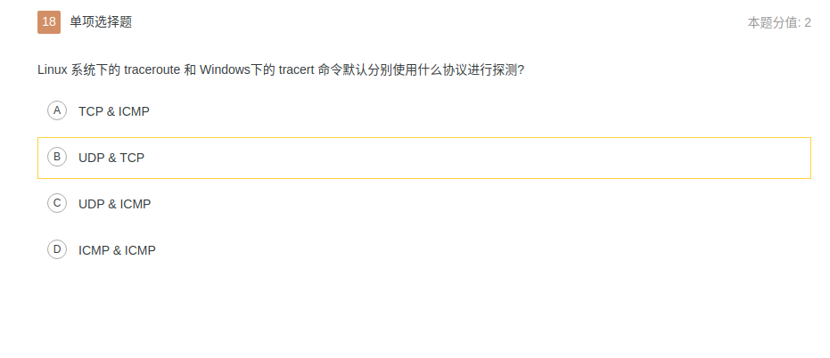traceroute和tracert详解

**traceroute**


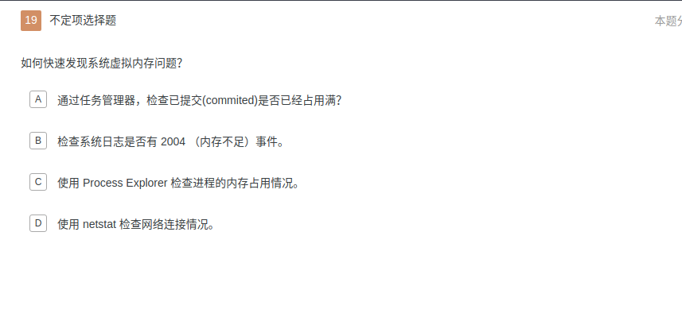


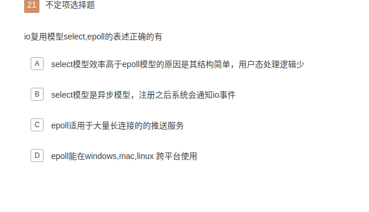


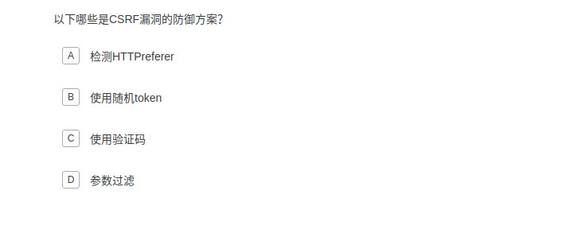


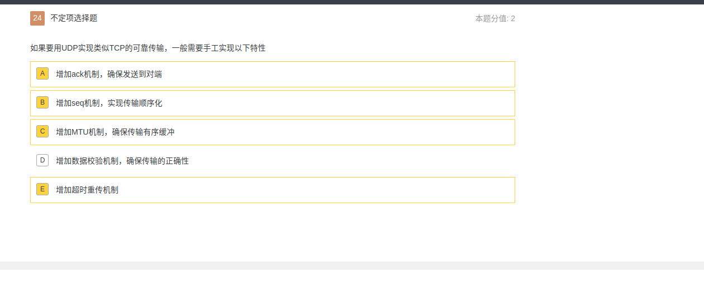


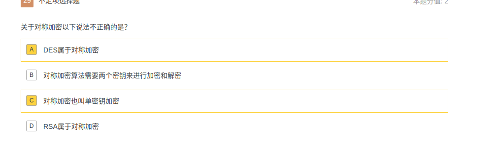


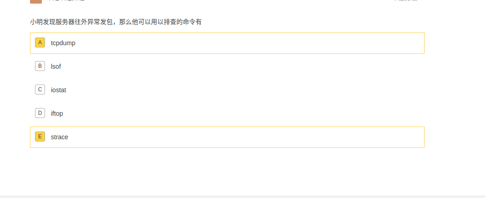

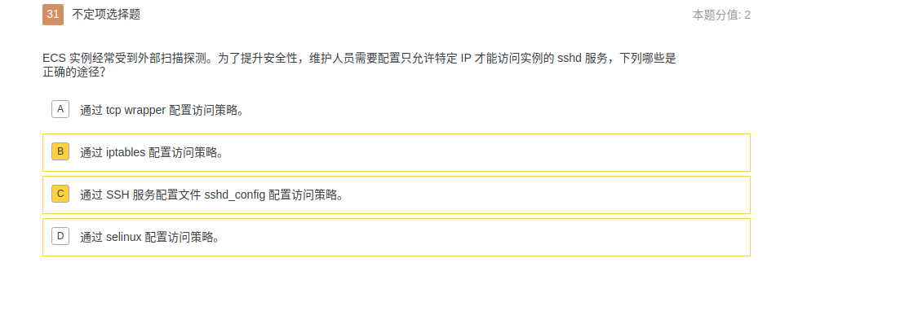

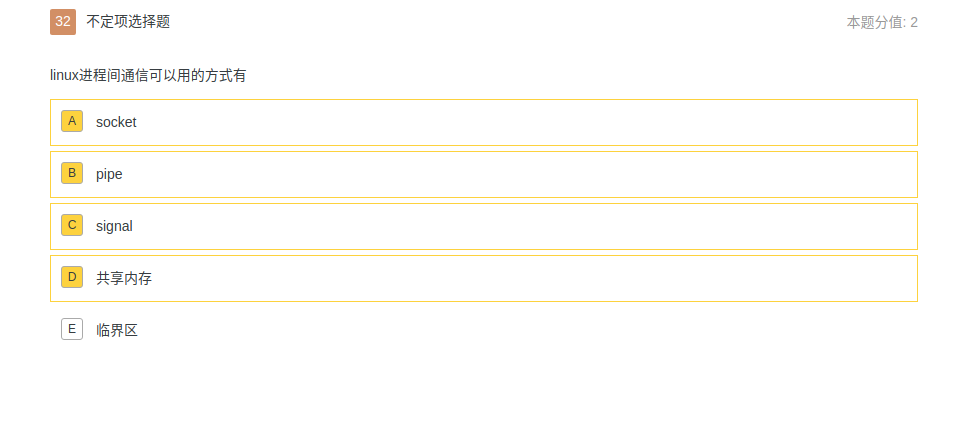

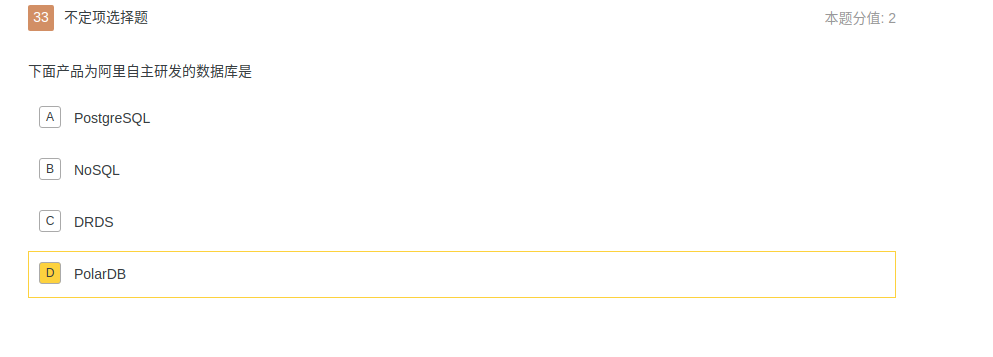


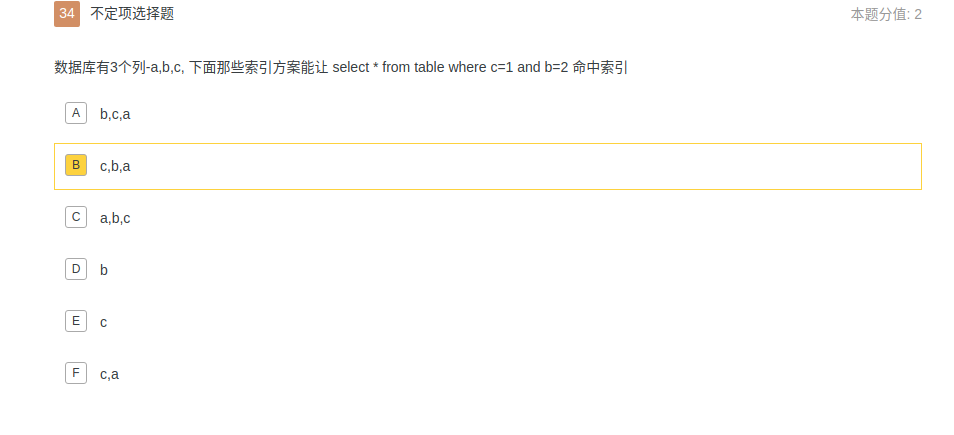

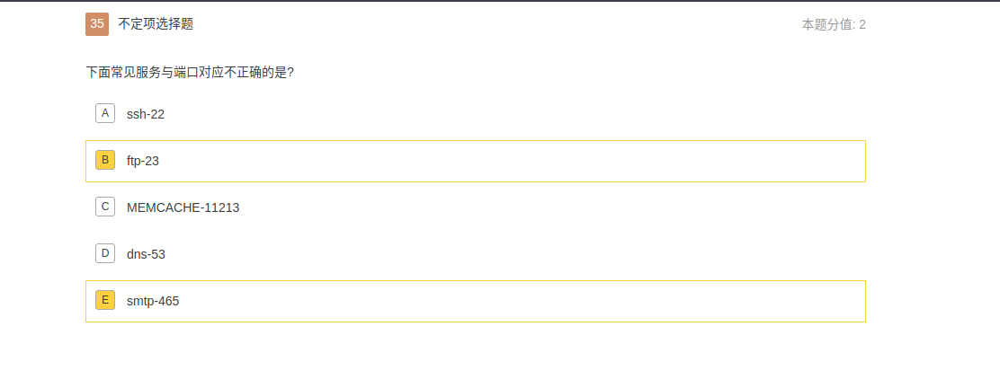

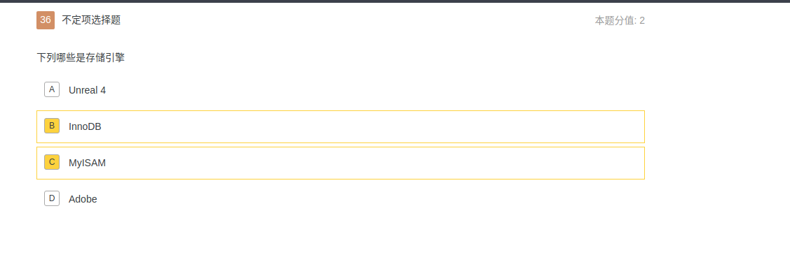

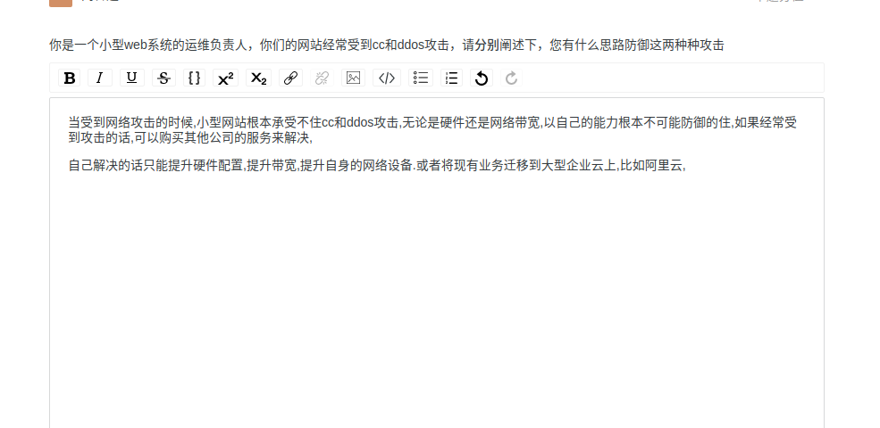

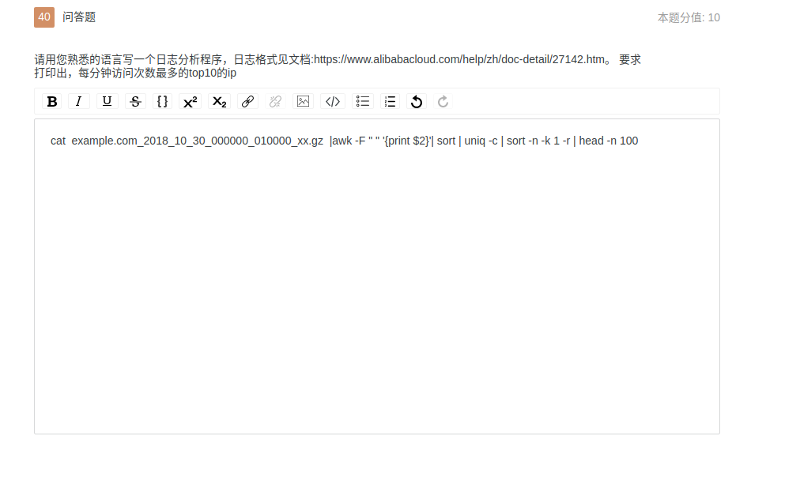


